# FleetMind



FleetMind is a Model Context Protocol (MCP) server, written in Go, that gives
an LLM agent broad **read-only** visibility into a Linux host. It ships as a
**strictly confined snap** whose only attached interfaces are observation
plugs — even a compromised agent cannot mutate the host.

The server speaks the [Streamable HTTP MCP transport][mcp-spec] on
`127.0.0.1:8765` (port configurable) behind bearer-token auth.

[mcp-spec]: https://modelcontextprotocol.io/specification

## Tool catalogue

| Tool | What it returns |
| --- | --- |
| `system_info` | Hostname, kernel, architecture, `/etc/os-release`, uptime |
| `cpu_info` | Model, vendor, logical cores, flags, frequency bounds |
| `memory_info` | RAM and swap usage, full `/proc/meminfo` |
| `load_info` | 1/5/15-minute load averages, running/total tasks |
| `list_processes`, `get_process` | Process snapshots from `/proc/[pid]` |
| `list_block_devices` | `lsblk -J -O` output |
| `list_mounts` | Mount table + `statfs` sizes |
| `list_network_interfaces`, `list_sockets` | Interface table; `ss`-derived socket inventory |
| `list_pci_devices`, `list_usb_devices` | Device IDs and bound kernel drivers |
| `kernel_info`, `list_kernel_modules` | Kernel build, cmdline, loaded modules |
| `list_dmi`, `list_sensors` | SMBIOS/DMI strings; hwmon temperatures, voltages, fans |
| `read_journal`, `read_dmesg` | Recent journald and kernel ring-buffer entries |
| `list_fleet` | Every MCP server the local node sees in its fleet (fleet mode) |

## Building locally

Requires Go ≥ 1.25.

```sh
make tidy build test lint
./bin/fleetmind --help
```

Run the daemon directly (outside a snap) with an explicit token:

```sh
FLEETMIND_TOKEN=devtoken ./bin/fleetmind --port 8765
```

Smoke-test the MCP endpoint:

```sh
curl -s -H 'Authorization: Bearer devtoken' \
     -H 'Content-Type: application/json' \
     -H 'Accept: application/json, text/event-stream' \
     -d '{"jsonrpc":"2.0","id":1,"method":"tools/list"}' \
     http://127.0.0.1:8765/mcp | head
```

## Web UI

The fleetmind binary ships a small operator console at
`http://127.0.0.1:8765/ui/`. It is a zero-dependency static SPA embedded via
`go:embed`; opening it in a browser gives you:

* a live view of the fleet roster, driven by the `/fleet/events` SSE stream;
* a chat panel that connects to the LLM provider of your choice (Anthropic,
  OpenAI, or any OpenAI-compatible base URL) and uses the FleetMind MCP tools
  to investigate the host you ask about.

The bearer token and LLM API key are kept in browser `localStorage` only — the
fleetmind server never sees the LLM key, and the LLM provider is called
directly from the browser.

## Testing

Unit tests cover the `/proc` and `/sys` parsers, auth middleware, and helper
functions. Integration tests live in `e2e/` and exercise the full MCP stack
(auth, transport, tool registry, and real host observability) on a live Linux
system.

```sh
# Fast unit tests
go test -race -count=1 ./...

# Integration tests (Linux only; starts an ephemeral in-process server)
go test -v -timeout=120s ./e2e/...
```

See [`e2e/README.md`](e2e/README.md) for architecture details and instructions
for running inside an LXD system container.

## Building the snap

```sh
make snap
sudo snap install --dangerous ./fleetmind_*.snap

# Connect non-auto-connect interfaces for log access:
sudo snap connect fleetmind:log-observe
sudo snap connect fleetmind:kernel-module-observe

# Retrieve the auto-generated bearer token:
sudo snap get fleetmind token

# Adjust the listen port if needed:
sudo snap set fleetmind port=9000
sudo snap restart fleetmind
```

## Wiring into an MCP client

Generic config block for any Streamable-HTTP-aware MCP client
(`~/.claude.json`, `.mcp.json`, Cursor `mcp.json`, etc.):

```json
{
  "mcpServers": {
    "fleetmind": {
      "type": "http",
      "url": "http://127.0.0.1:8765/mcp",
      "headers": {
        "Authorization": "Bearer <token from `snap get fleetmind token`>"
      }
    }
  }
}
```

### Claude Code

Add with the CLI in one shot (project-scoped, writes to `.mcp.json`):

```sh
claude mcp add --transport http --scope project fleetmind \
  http://127.0.0.1:8765/mcp \
  --header "Authorization: Bearer $(sudo snap get fleetmind token)"
```

Swap `--scope project` for `--scope user` to register it globally.
Run `/mcp` inside Claude Code to verify the connection and inspect the
tool list.

#### Allow-listing the tools

Every FleetMind tool is read-only by snap confinement, so it is safe to
pre-approve the whole server and skip per-call permission prompts. Add
to `.claude/settings.json` (project) or `~/.claude/settings.json`
(global):

```json
{
  "permissions": {
    "allow": ["mcp__fleetmind"]
  }
}
```

`mcp__fleetmind` covers every current and future tool on this server.
For a tighter grant, list specific tools: `mcp__fleetmind__read_journal`.

#### Teaching the agent when to reach for FleetMind

Drop a paragraph into your project or user `CLAUDE.md` so Claude
prefers these tools over shelling out. Example:

```md
## FleetMind MCP

When the user asks about the local Linux host (hardware, processes,
mounts, network, logs, sensors, kernel), prefer the fleetmind MCP
tools over running shell commands. They are strictly read-only.

- "what's running?"            → list_processes
- "why is disk full?"          → list_mounts, list_block_devices
- "any kernel errors lately?"  → read_dmesg, read_journal {priority:"err"}
- "what hardware is this?"     → list_dmi, list_pci_devices, cpu_info
```

For recurring workflows, bundle them into a slash command — e.g.
`.claude/commands/host-audit.md` that asks the agent to run a fixed
sequence of FleetMind tools and format a report.

## Fleet mode

Multiple FleetMind instances can form a static, full-mesh fleet so an LLM
agent connected to any one node can enumerate every other MCP server it should
also talk to. Discovery is **explicit** (kubeadm-style): you tell a new node
the URL of an existing one, the new node fetches the roster, then connects to
every member.

CLI flags (all also readable from snap config — keys `fleet`, `join-url`,
`advertise-url`):

| Flag | Meaning |
| --- | --- |
| `--fleet` | Enable fleet mode (mounts `/fleet/*` and runs the peer manager) |
| `--join-url <url>` | Bootstrap: URL of any existing fleet node. Empty = solo fleet |
| `--advertise-url <url>` | URL other peers should dial to reach **this** node. Defaults to `http://<bind>:<port>` |
| `--bind <ip>` | Interface to bind on. `127.0.0.1` for same-host fleets; a routable IP for cross-host |

Wire endpoints (all under the shared bearer token):

* `POST /fleet/join` — body `{"peer": {...}}`; response `{"peers": [...]}`
* `GET /fleet/peers` — current roster as JSON
* `GET /fleet/events` — Server-Sent Events stream: `heartbeat`, `peer_added`,
  `peer_removed`. The current roster is replayed once on subscribe.

Heartbeats fire every 10 s; peers with no heartbeat for 30 s are evicted and a
`peer_removed` event is broadcast.

Inspect the fleet from any node via the new MCP tool:

```sh
curl -s -H "Authorization: Bearer $TOKEN" \
     -H 'Content-Type: application/json' \
     -H 'Accept: application/json, text/event-stream' \
     -d '{"jsonrpc":"2.0","id":1,"method":"tools/call",
          "params":{"name":"list_fleet","arguments":{}}}' \
     http://127.0.0.1:8765/mcp
```

### Three-node localhost demo

```sh
# All three nodes share the same bearer token.
export FLEETMIND_TOKEN=devtoken

# Seed node (no --join-url).
./bin/fleetmind --fleet --port 8765 --advertise-url http://127.0.0.1:8765 &

# Two more nodes bootstrap from the seed.
./bin/fleetmind --fleet --port 8766 \
  --advertise-url http://127.0.0.1:8766 \
  --join-url http://127.0.0.1:8765 &
./bin/fleetmind --fleet --port 8767 \
  --advertise-url http://127.0.0.1:8767 \
  --join-url http://127.0.0.1:8765 &
```

`list_fleet` on any of the three will then return all three members.

### Two-VM LXD demo

For a realistic, snap-confined test across machines without leaving your laptop,
`scripts/fleet-up-lxd.sh` automates the whole flow: build the snap, launch two
Ubuntu LXD VMs, install the snap in each, configure one as the seed and the
other as a joiner with a shared bearer token, then print the
`claude mcp add` command pre-filled with the seed's bridge IP and token.

```sh
scripts/fleet-up-lxd.sh           # bring it up
scripts/fleet-down-lxd.sh         # tear it down
```

Requires `lxc`, `snapcraft`, `jq`, `curl` and `openssl` on PATH, plus the
in-flight `bind`-via-snap-config support (see the script's header for the
issue link).

### Snap configuration

```sh
sudo snap set fleetmind fleet=true
sudo snap set fleetmind advertise-url=http://<this-host>:8765
sudo snap set fleetmind join-url=http://<seed-host>:8765   # omit on the seed
sudo snap restart fleetmind
```

## Threat model

* Strict confinement plus a curated plug list (`hardware-observe`,
  `system-observe`, `mount-observe`, `network-observe`, `log-observe`,
  `kernel-module-observe`, `network-bind`, `network`) is the safety boundary.
  The snap has no `*-control` plug, no shell, no writeable paths outside
  `$SNAP_COMMON` and `$SNAP_DATA`. The `network` plug is required so the
  daemon can dial other fleet members; it does not widen what the read-only
  tools can do.
* Bearer-token auth gates **both** the MCP and `/fleet/*` endpoints. The same
  token doubles as the shared fleet secret. It is generated by the daemon on
  first start (32 bytes from `crypto/rand`), persisted via
  `snapctl set token=…`, and mirrored to `$SNAP_COMMON/token` (0600).
* The listener binds `127.0.0.1` by default. In fleet mode you may bind to a
  routable IP via `--bind` and supply an explicit `--advertise-url`; every
  peer URL is dialled with the bearer token. The MCP SDK adds DNS-rebinding
  protection out of the box.
* External binaries (`lsblk`, `ss`, `journalctl`, `dmesg`) are invoked through
  a small wrapper that pins `argv[0]`, sets `LC_ALL=C`, applies a 10-second
  timeout and caps stdout at 4 MiB.

## Repository layout

```
cmd/fleetmind          program entrypoint
e2e/                   integration tests (MCP client/server round-trip)
internal/mcpserver     server wiring, bearer auth, token bootstrap
internal/fleet         peer registry, /fleet/* HTTP handlers, SSE manager
internal/tools         one file per MCP tool, plus the registry
internal/exectool      safe wrapper around os/exec
internal/procfs        /proc parsers
internal/sysfs         /sys parsers
internal/snapconf      snapctl get/set wrapper
snap/                  snapcraft.yaml and hooks
```
